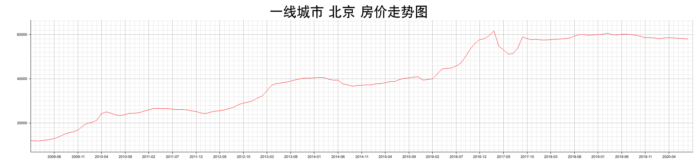

## 全国历史房价爬取


### 准备
本程序使用Rust语言开发，需安装Rust运行环境。 

安装Rust [安装入口](https://www.rust-lang.org/zh-CN/tools/install)
 
程序运行前需要登陆https://www.anjuke.com/fangjia/，进行滑块验证。

### 运行

编译程序  ```cargo build  --release```

运行 ``` ./target/release/fangjia ```   

### 结果

